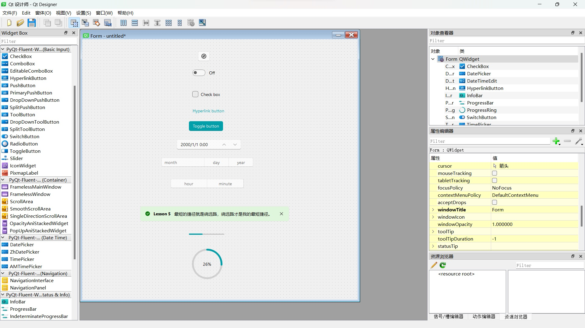

<p align="center">
  
</p>
  <h1 align="center">
  PyQt-Fluent-Widgets
</h1>
<p align="center">
  基于 PyQt5 的 Fluent Design 风格组件库
</p>


<div align="center">

[](https://pypi.org/project/PyQt-Fluent-Widgets)
[]()
[](LICENSE)
[]()

</div>

<p align="center">
<a href="../README.md">English</a> | 简体中文 | <a href="https://qfluentwidgets.com/">官方网站</a>
</p>


## 安装📥
安装轻量版 (亚克力组件不可用)：
```shell
pip install PyQt-Fluent-Widgets -i https://pypi.org/simple/
```
安装完整版：
```shell
pip install "PyQt-Fluent-Widgets[full]" -i https://pypi.org/simple/
```

如果项目中使用的是 PySide2、PySide6 或者 PyQt6，需切换至 [PySide2](https://github.com/zhiyiYo/PyQt-Fluent-Widgets/tree/PySide2)、[PySide6](https://github.com/zhiyiYo/PyQt-Fluent-Widgets/tree/PySide6) 和 [PyQt6](https://github.com/zhiyiYo/PyQt-Fluent-Widgets/tree/PyQt6) 分支下载对应的代码。

[商用高级版](https://qfluentwidgets.com/zh/pages/pro) 组件库包含更多组件，可从 [发行页面](https://github.com/zhiyiYo/PyQt-Fluent-Widgets/releases) 下载体验编译好的示例程序 `PyQt-Fluent-Widgets-Pro-Gallery.zip`。

C++ QFluentWidgets 组件库非开源，可从 [发行页面](https://github.com/zhiyiYo/PyQt-Fluent-Widgets/releases) 下载体验编译好的示例程序 `C++_QFluentWidgets.zip`，价格见 [官网](https://qfluentwidgets.com/zh/price)。

> [!Warning]
> 请勿同时安装 PyQt-Fluent-Widgets、PyQt6-Fluent-Widgets、PySide2-Fluent-Widgets 和 PySide6-Fluent-Widgets，因为他们的包名都是 `qfluentwidgets`


## 运行示例▶️
使用 pip 安装好 PyQt-Fluent-Widgets 包并下载好此仓库的代码之后，就可以运行 examples 目录下的任意示例程序，比如：
```shell
cd examples/gallery
python demo.py
```

如果遇到 `ImportError: cannot import name 'XXX' from 'qfluentwidgets'`，这表明安装的包版本过低。可以按照上面的安装指令将 pypi 源替换为 https://pypi.org/simple 并重新安装.


## 许可证📄
PyQt-Fluent-Widgets 使用 [GPLv3](./LICENSE) 许可证授权非商用项目，商用项目需购买[商用许可证](https://qfluentwidgets.com/zh/price)。

组件库受软件著作权保护，软著登字第12532763号，任何盗用、破解组件库或未经授权的商业使用均被视为侵权行为。

版权所有 © 2021 by zhiyiYo.

## 在线文档📕
想要了解 PyQt-Fluent-Widgets 的正确使用姿势？请仔细阅读 [帮助文档](https://qfluentwidgets.com/zh/) 👈


## Fluent Client🚩
[Fluent Client](https://qfluentwidgets.com/zh/pages/designer) 集成了设计师插件和脚手架功能，支持在 Designer 中直接拖拽使用 QFluentWidgets 的组件，所见即所得，让现代化界面搭建如丝般顺滑！可在 [淘宝](https://item.taobao.com/item.htm?ft=t&id=767961666600) 购买使用 Fluent Client。



## 问题反馈💡
如果在使用过程中遇到问题，请先查阅官网文档。若确认问题为组件库的 bug，请将操作系统信息、组件库版本、最小复现代码和复现步骤发送至 [shokokawaii@outlook.com](mailto:shokokawaii@outlook.com)。


## 另见👀
下面是一些基于 PyQt-Fluent-Widgets 的项目：
* [**zhiyiYo/Fluent-M3U8**: 美观易用的跨平台 m3u8 下载器](https://fluent-m3u8.org)
* [**zhiyiYo/Groove**: 基于 PyQt5 的跨平台音乐播放器](https://github.com/zhiyiYo/Groove)
* [**zhiyiYo/Alpha-Gobang-Zero**: 基于强化学习的五子棋机器人](https://github.com/zhiyiYo/Alpha-Gobang-Zero)

## 参考
* [**Windows design**: Design guidelines and toolkits for creating native app experiences](https://learn.microsoft.com/zh-cn/windows/apps/design/)
* [**Microsoft/WinUI-Gallery**: An app demonstrates the controls available in WinUI and the Fluent Design System](https://github.com/microsoft/WinUI-Gallery)
