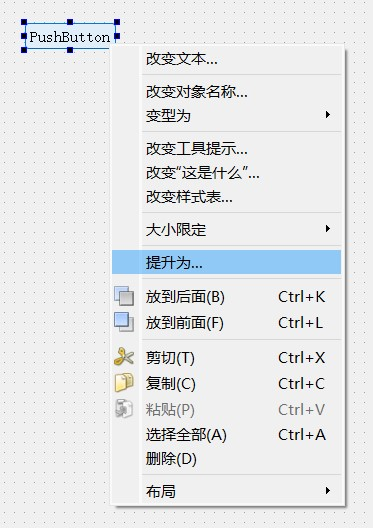
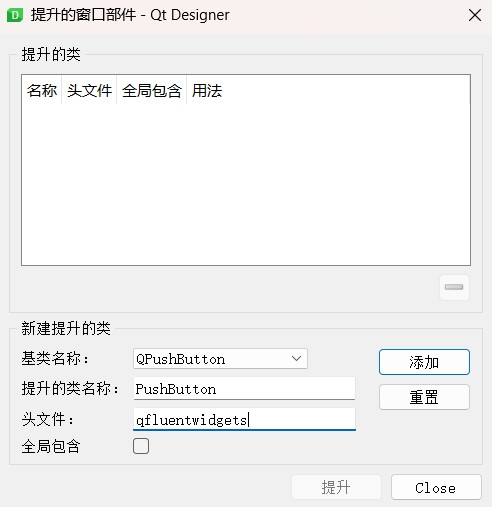

Designer
--------

In Qt Designer, there are two ways to use PyQt-Fluent-Widgets.

Promoting widget
^^^^^^^^^^^^^^^^

Right click on a widget, select the ``Promote to ...`` of context menu.

Promoting a widget indicates that it should be replaced with the specified subclass, in our case the ``qfluentwidgets.PushButton``.

You will be presented with a dialog to specify the custom widget class the placeholder widget will become.

The header file is the name of the Python module used to import the class, which is ``qfluentwidgets``. Specify ``PushButton`` as the class name of the widget to replace it with.

Well, the widget is now promoted to fluent push button. But you won't be able to see any changes within Qt Designer. Save the window as ``mainwindow.ui`` and compile it to python code, you will see that the ``PushButton`` is imported from ``qfluentwidgets`` package.

.. raw:: html

   

      <iframe style="position: absolute; width: 100%; height: 100%; left: 0; top: 0;" src="https://player.bilibili.com/player.html?cid=1107159421&aid=655415814&page=1&as_wide=1&high_quality=1&danmaku=0" frameborder="no" scrolling="no" allowfullscreen="true"></iframe>
   

Using plugin
^^^^^^^^^^^^

Complex example
^^^^^^^^^^^^^^^
Here is an example that uses a side navigation bar to implement multiple sub-interfaces window.

.. raw:: html

   

      <iframe style="position: absolute; width: 100%; height: 100%; left: 0; top: 0;" src="https://player.bilibili.com/player.html?cid=1193201502&aid=530806716&page=1&as_wide=1&high_quality=1&danmaku=0" frameborder="no" scrolling="no" allowfullscreen="true"></iframe>
   

