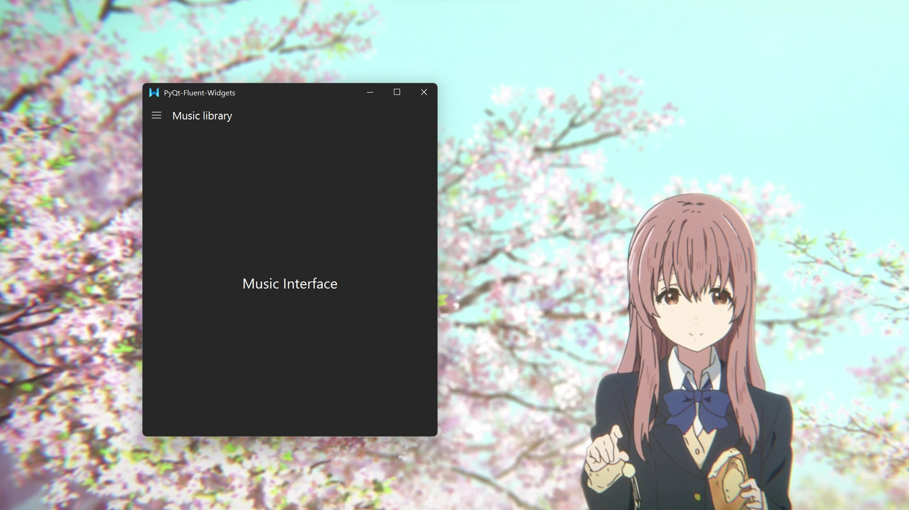

## Navigation
### Structure

PyQt Fluent Widgets provides a side navigation class `NavigationInterface`. You can use it with `QStackWidget` and put them in `QHBoxLayout`. Examples are available at https://github.com/zhiyiYo/PyQt-Fluent-Widgets/tree/master/examples/navigation2.


`NavigationInterface` contains `NavigationPanel` which is used to place navigation menu items. All navigation menu items should inherit from `NavigationWidget` and you can add them to the panel by calling `NavigationInterface.addWidget()` or `NavigationPanel.addWidget()`. PyQt-Fluent-Widgets implements subclass `NavigationPushButton` and provides a convenient method `NavigationInterface.addItem()` to add it to the panel.

If you want to customize a navigation menu item, you should inherit the `NavigationWidget` and rewrite its `paintEvent()` and `setCompacted()`(optional). Here an example shows how to create an avatar item.
```python
from qfluentwidgets import NavigationWidget


class AvatarWidget(NavigationWidget):
    """ Avatar widget """

    def __init__(self, parent=None):
        super().__init__(isSelectable=False, parent=parent)
        self.avatar = QImage('resource/shoko.png').scaled(
            24, 24, Qt.KeepAspectRatio, Qt.SmoothTransformation)

    def paintEvent(self, e):
        painter = QPainter(self)
        painter.setRenderHints(
            QPainter.SmoothPixmapTransform | QPainter.Antialiasing)

        painter.setPen(Qt.NoPen)

        if self.isPressed:
            painter.setOpacity(0.7)

        # draw background
        if self.isEnter:
            c = 255 if isDarkTheme() else 0
            painter.setBrush(QColor(c, c, c, 10))
            painter.drawRoundedRect(self.rect(), 5, 5)

        # draw avatar
        painter.setBrush(QBrush(self.avatar))
        painter.translate(8, 6)
        painter.drawEllipse(0, 0, 24, 24)
        painter.translate(-8, -6)

        if not self.isCompacted:
            painter.setPen(Qt.white if isDarkTheme() else Qt.black)
            font = QFont('Segoe UI')
            font.setPixelSize(14)
            painter.setFont(font)
            painter.drawText(QRect(44, 0, 255, 36), Qt.AlignVCenter, 'zhiyiYo')
```

Now let's take a look at the parameters required for the `addWidget()` methed:

```python
def addWidget(
    self,
    routeKey: str,
    widget: NavigationWidget,
    onClick=None,
    position=NavigationItemPosition.TOP,
    tooltip: str = None,
    parentRouteKey: str = None
)
```

As you can see, this method requires four parameters:

* `routeKey`: A unique name for the `widget` to be added. You can consider the sub interface in the `QStackWidget` as a web page, and the `routeKey` is the url of the web page. When you switch between sub interfaces, `NavigationPanel` will add a `routeKey` to the navigation history. When you click the return button, the `routeKey` at the top of the navigation history will pop up. If there are other `routeKeys` in the history at this time, PyQt-Fluent-Widgets will switch to the corresponding sub interface corresponding to current top `routeKey`. Otherwise, it will switch to the sub interface corresponding to `defaultRouteKey`, so you should call `NavigationInterface.setDefaultRouteKey()` before running app.
* `widget`: The widget to be added to panel.
* `onClick`: Slot function connected to the widget's `clicked` signal. If you want to switch sub interfaces when clicking `widget`t, it is recommended to write this slot function as `lambda: self.stackWidget.setCurrentWidget(self.xxxInterface) `.
* `position`: Where to add the `widget` to the panel. The following values are available:
  * `NavigationItemPosition.TOP`: add `widget` to the top layout of panel.
  * `NavigationItemPosition.SCROLL`: add `widget` to the scroll layout of panel. You can scroll the widgets in scroll layout When there are too many menu items.
  * `NavigationItemPosition.BOTTOM`: add `widget` to the bottom layout of panel.
* `tooltip`: The tooltip of menu item.
* `parentRouteKey`: The route key of parent menu item, the widget of parent item must be the instance of `NavigationTreeWidgetBase`

### Display mode

The navigation panel has four display modes:

* `NavigationDisplayMode.EXPAND`: An expanded left pane on large window widths (1008px or greater).
  

* `NavigationDisplayMode.COMPACT`: A left, icon-only, nav panel on medium window widths (1007px or less).
  

* `NavigationDisplayMode.MENU`: An expanded left menu (1007px or less).
  

* `NavigationDisplayMode.MINIMAL`: Only a menu button on small window widths (you should add and manage the menu button to main window by yourself like [navigation3](https://github.com/zhiyiYo/PyQt-Fluent-Widgets/tree/master/examples/navigation3) does).

If you call `NavigationInterface.setExpandWidth()`, the large window width (1008px) will change accordingly.


### More examples
Here is an another style of navigation interface, and its corresponding example program is available at https://github.com/zhiyiYo/PyQt-Fluent-Widgets/tree/master/examples/navigation.


Minimal display mode navigation interface is available at [navigation3](https://github.com/zhiyiYo/PyQt-Fluent-Widgets/tree/master/examples/navigation3).


