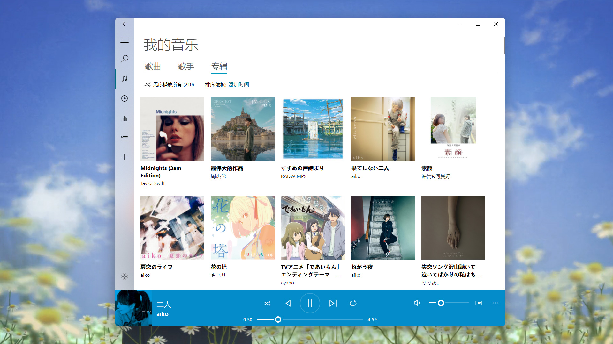
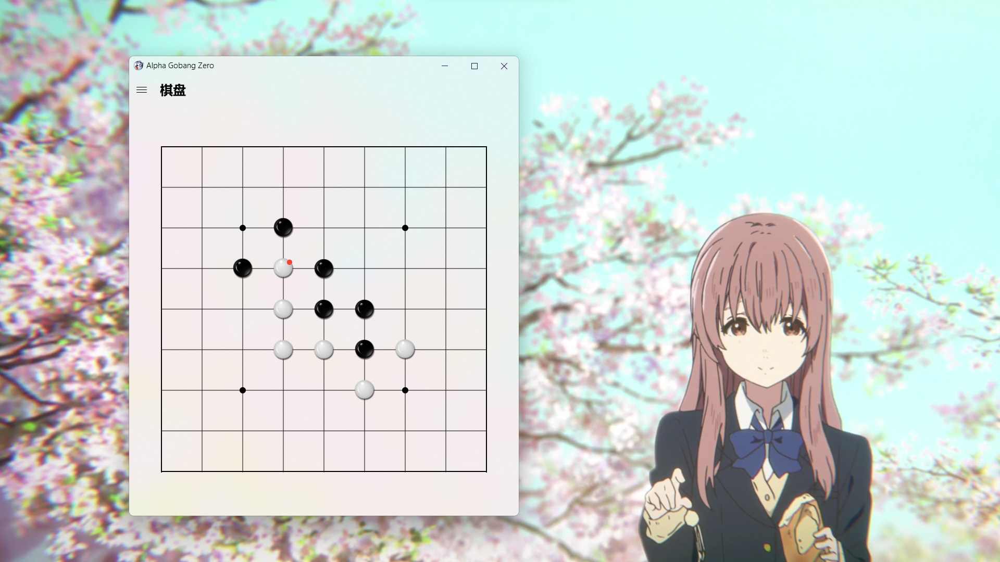

## See also

Here are some projects that use PyQt-Fluent-Widgets:

- [**zhiyiYo/QMaterialWidgets**: A material design widgets library based on PySide](https://github.com/zhiyiYo/QMaterialWidgets)
  

 

- [**zhiyiYo/Groove**: A cross-platform music player based on PyQt5](https://github.com/zhiyiYo/Groove)
  

 

- [**zhiyiYo/Alpha-Gobang-Zero**: A gobang robot based on reinforcement learning](https://github.com/zhiyiYo/Alpha-Gobang-Zero)
  